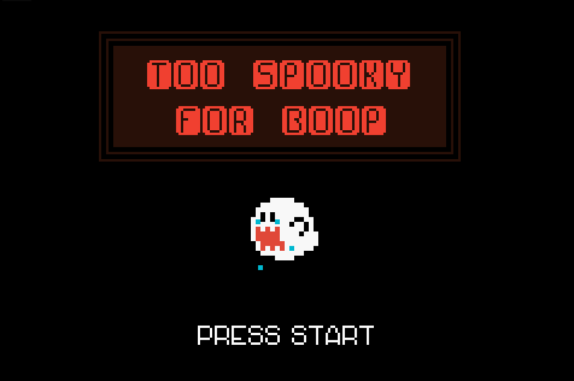
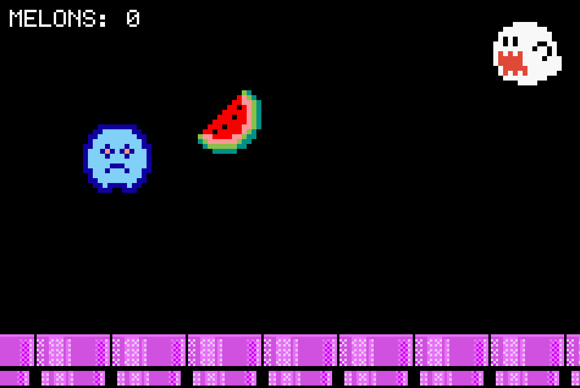

# Too Spooky For Boop
#### Author: Rosemary Blair #

## About 

A very simple Gameboy Advance game that I created in roughly three days.
It's written in C and is playable using this GBA emulator: https://github.com/TricksterGuy/nin10kit.
The purpose of this was to learn more about graphics and DMA (direct memory allocation) in C.

## Gameplay

*Spoop the ghost needs **your** help!*

As all resident ghosts of Spooky Town love watermelon, no ghost loves it quite as much as our friend, Spoop.
Spoop spends his days dreaming of this delicious fruit, but is too shy to ever leave his home to find some.
After years of watermelon deprivation, Spoop gets enough courage to leave his home so he can once again enjoy
the delicious fruit of his dreams. However, Spoop soon realizes how intimidating the other ghosts around town
are. In order for Spoop to claim all of the watermelon he's missed out on, he **must** avoid all contact with
the other ghosts around him. 

Collect as many watermelon slices as possible *without touching other ghosts*. Bumping into one will cause
Spoop to get spooked so hard that he drops all of his watermelon (and the game will end). You can track how
many you've gotten by the counter in the corner. Help Spoop gather watermelon and see how long you can last!

## Controls

Navigate Spoop using the up, down, left, and right arrow keys.
Press BACKSPACE (or DELETE) to return to the main screen within the game.
Press ENTER on the game over screen to start a new game.

## Other Information
 
All sprites and images were drawn by me, illustrated using GIMP.
The designs for Spoopy and the background pipes are based off of objects from the Mario Bros series.

This was my first attempt at a GBA game, so presence of flaws is highly likely.

